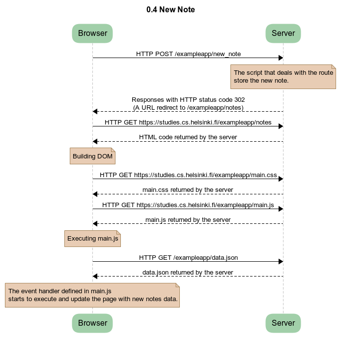
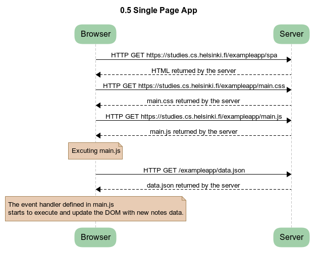
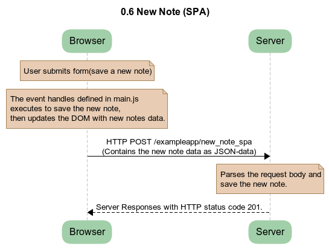

# Full Stack Open - Exercise Solutions

## Part 0 - Fundamentals of Web apps

### Course Material

https://fullstackopen.com/en/part0

### Exercise Discription

https://fullstackopen.com/en/part0/fundamentals_of_web_apps#exercises-0-1-0-6

## Solutions

### 0.4 New Note

### 0.5 Single Page App

### 0.6 New Note (SPA)

